# Cuaderno Lenguaje de marcas

## Tabla de contenidos

## Enlaces de interes
* https://www.w3.org/

## Actividad Cuaderno UD1
### Añadir los siguientes apartados:
#### Que es un lenguaje de marcas
Es un modo de codificar un documento junto con el texto que permite incorporar etiquetas con informacion adicional del texto
#### Evolucion de los Lenguajes de marcas:
* GML Es un sublenguaje de XML que se utiliza para el modelaje, transporte y almacenamiento de informacion geografica, basicamente es un archivo que contiene inforamcion acerca de las coordenadas de una parcela o edificacion. Fue creado por charles Goldfarb, Edwad Mosher y Raymon lorie entre 1969 y 1970

* SGML Es un estandar para definir lenguajes de marcado generalizados para documentos, fue diseñador en la decada de 1980 por la ISO y se convirtio en el estandar internacional para la creacion de documentos electronicos complejos

#### Características de los lenguajes de marcas

Las principales caracteriticas del leguaje de marcas son los siguientes:

**Independecia** (Su uso no depende de ninguna plataforma hardware ni software concreto)

**Almacenados en texto plano** (El documento solo esta compuesto por caracteres texto)

**Flexibilidad** (Deben ser flexibles para utilizarlos en diferentes contextos)

**Compactibilidad** (Las marcas y el contenido estan dentro del mismo documento) 

**Facilidad de procesamiento** (El formato debe tener un diseño sencillo para que el procesamiento automatico sea facil).

#### Características y ejemplos de los siguientes lenguajes de marcas
* XML

**Extensible:** Define nueva etiquetas

**Estructurado:*** Se puede modelar datos a cualquier nivel de complejidad

**Validable:** Cada documento se puede validad frente a una DTD
Independiente de medio: Puede publicarse en multiples formatos

**Independiente de fabricante:** XML es una herramienta facil de aprender y usar

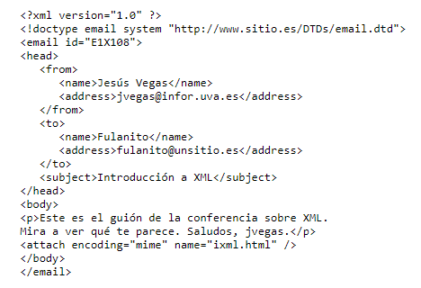
* HTML

**Es facil de usar y aprender**

**Se utiliza para crear paginas**

**Permite describir hipertextos**

**permite archivos pequeños**

**Tiene etiquetas limitadas**

**Lenguaje estatico**

**Tiene un despliegue rapido**

**Es multiplataforma, basicamente se accede de cualquier lado**

* JSON

**Es un lenguaje modelador de datos**

**Consistes en pares claves-valor**

**Formato flexible, ligero y facilmente transferible a traves de las redes**

* YAML

**Utiliza la tabulacion para indicar su estructura**

**Lo elementos que forman una secuencia utilizan un guion medio**

**Los contenidos en YAML se describen utilizando el conjunto de caracteres imprimibles de Unicode, bien en UTF-8 o UTF-16**

**Los comentarios vienen encabezados por la almohadilla**
** **

#### XML: definicion y caracteristicas del metalenguaje
XML es un metalenguaje que te va a permitir mediante varias etiquetas crear nuevos lenguajes de marcas o dialectos debido a unas reglas que define, esta mantenido por la W3C y proviene del estandar SGML
* Prologo: Es un documento XML opcional que tiene informacion relativa al propiodocumento, contiene los siguientes elementos

 **Version** Es la version de xml

 **Encoding** Indica en que esta codificado el documento

 **standalone** Indica la existencia de un esquema XML

 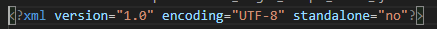

* Contenido: Es todo lo que se encuentra entre las etiquetas de apertura y cierre

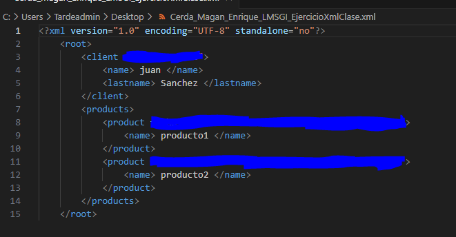
* Atributos: Es una opcion del xml que te aporta informacion extra sobre el elemento que contiene

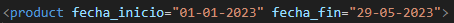
* Ejemplos en XML

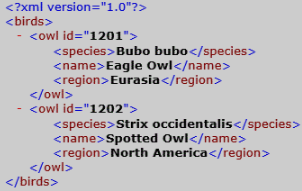

Aqui tenemos un ejemplo que habla sobre pajaros, y se centra en las especies,nombres y en la region que viven los buhos

## Documentos XML, estructura:
La **Declaracion o prologo** es un elemento opcional que esta a principio del documento, puede contener los siguientes atributos

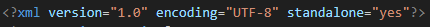

Aqui en el siguiente ejemplo podemos ver un prologo con sus atributos

Los **elementos** son contenedores que almacenan texto, atributos, elementos
atributos, objetos de soporte

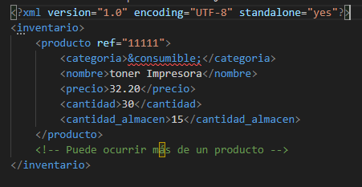

Aqui se puede ver un ejemplo para quede mas claro 

Los **atributos** son informacion adicional dentro de un elemento que tiene que tener un valor entre comillas, siempre debe aparecer en la etiqueta de apertura, pueden ser opcionales y pueden comenzar con un guion bajo o caracter

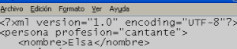

Un **comentario** añade informacion extra sin que tenga que ser procesada, suele utilizarse para ayudar y guiar al usuario

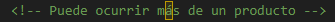

Aqui se ve un ejemplo de comentario

Los **Espacios de Nombres** es un identificador que nos sirve para resolver ambiguedades que pueden surgir conado hay dos o mas elementos iguales
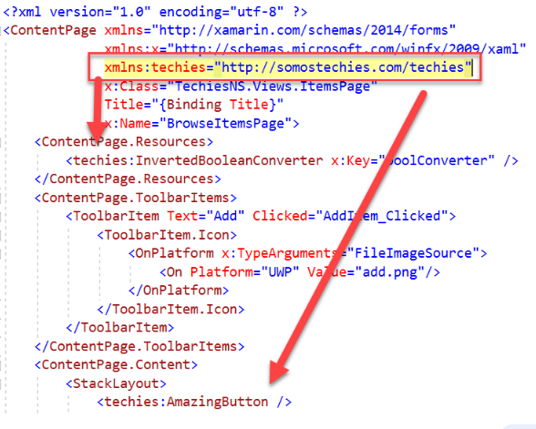
Aqui se puede observar un ejemplo en un xml

Entidades permite incluir informacion predefinida en un documento, existen 5 entidades generales
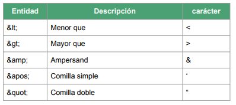

Estas son las 5 entidades que existen

CDATA son conjuntos de caracteres que no debe ser tratado por el analizador que si formara parte de la informacion a diferencia del comentario 

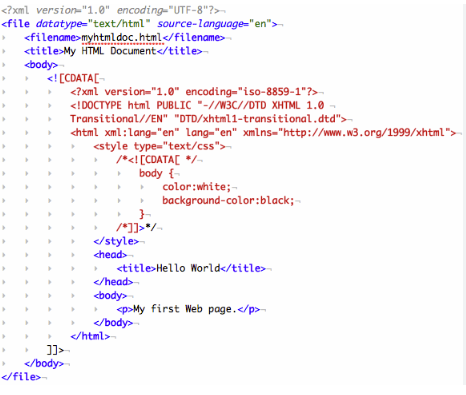

Aqui tenemos un ejemplo del CDATA

## Validación de documentos:
es la comprobación de que un documento en lenguaje XML está bien formado y se ajusta a una estructura definida
### DTD:
Es una serie de reglas que van a permitir validar que la estructura de un documento es valida, puede ser interno (forma parte del documento)

Las **Entidades** sirven para establecer un valor en el dtd, existen entidades **internas** definidas en el propio dtd y entidades **externas** definidas fuera del dtd

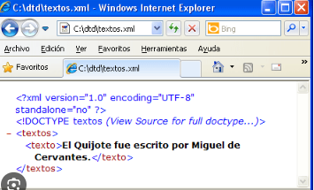

**Anotaciones** nos permite identificar el formato de entidades que no son xml y que no se van a procesar, pueden ser publicas o prividas

**Elementos** sirve para definir una estructura de uno o varios elmentos que contiene el documento, podemos definir una cardinalidad a cada elemento 
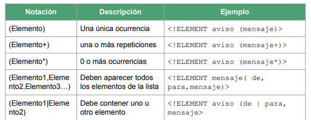

**Atributos** en dtd sirve para dar mas informacion sobre el elemento

Aqui tenemos un ejemplo de un atributo en dtd

### XMLSchema
Definición Es un lenguaje de esquema utilizado para describir la estructura y las restricciones de los contenidos de los documentos XML

La Estructura Básica es la siguiente:
* Elementos
* restricciones
* subElemntos
* Atributos
* Comentarios

Los **elementos** se pueden clasificar en:
 * **Locales:** Hijos de los elementos que no son el elemento raíz y  sólo se usan una vez.
 * **Globales:** Hijos del elemento raíz y pueden ser reutilizados.

**Elementos Simples** Guarda un texto, numero, fecha,etc.. se debe establecer el atributo type o utiizar una restriccion

**Elementos Complejos** Guara dentro elementos hijos y se pueden establecer restricciones a las relaciones

**Subelementos** son los establecen una relacion de lso elementos contenidos respecto al padre, son los siguientes

  * xs:sequence: Indica una secencia de elementos obligatorios contenidos con respecto al padre

  * xs:choice: señala una secuencia de elementos alternativos

  * xs:all: inidica una secuencia de elemntos opcionales 

**Atributos** se pueden guardar tanto en elementos simples y complejos, aqui a continuacion los valores que se pueden poner:
* name: nombre del atributo
* type: tupo de datos
* use: Indica su obligatoriedad, hay los siguientes
  * required: Es obligatorio
  * optional: Es opcional
  *  prohibited: Esta prohibido usarlo

**Restricciones** sirve para establecer unas prohibiciones dentro del documento
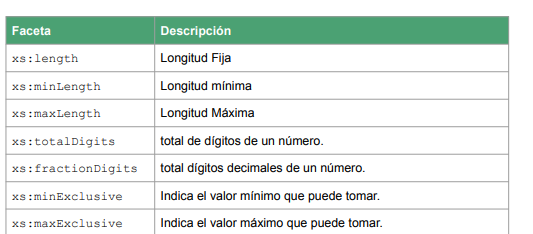
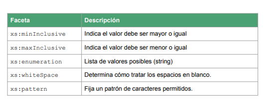

**Tipos de Datos** ahora acontinucacion se vera una captura con algunos de los tipos de datos que puedes introducir en xmlschema
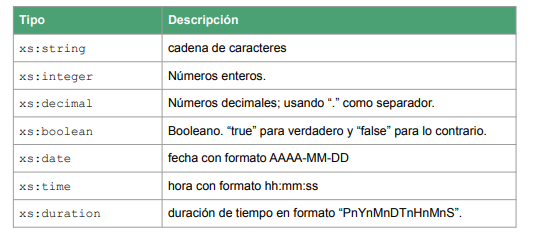

Comentarios en XMLSChema se establecen comentarios para ayudar a su comprension
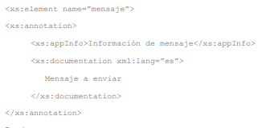

Aqui se ve como se introduce el comentario

# Sistemas de gestión de información:
Un **Sistema de gestión de Información**, son programas informáticos, diseñados para dar soporte a cualquier de los procesos que se realizan en una empresa. Todos los sistemas de gestión de información pueden ejecutarse tanto en máquinas locales, como en otras pertenecientes a terceras empresas mediante la computación en la nube.
* Características 
   * Búsqueda y seguimiento de la redundancia de los datos
   * Consistencia en la información almacenada
   * Integridad de la información asegurada
   * Seguridad de la base de datos

* Tipos: Podemos encontrar tres tipos de sistemas de gestion de la informacion
  * **ERP**(Sistema de planificación de recursos empresariales o Enterprise Resource Planning):  Es un sistema informático que integra los múltiples procesos específicos que hay en una empresa. Un ERP, puede considerarse un producto software que cubren una necesidad pero sin estar dirigido a una empresa en concreto que ,normalmente, puede ser personalizado

  * **CRM** (Customer RelationShip Management): Es un tipo de Sistema de Gestión de información específico para atender todo lo relacionado con los clientes y la relación con la propia empresa. Es una herramienta fundamental en la gestión del activo más importante para cualquier empresa

  * **BI** (Bussines itelligence): Son una serie de tecnologias que tienen un objetivo en común que es ayudar en el proceso de dirección de una empresa
# ERP
* **Características**
  * Funcional
  * Modular
  * Centralizado
  * Robusto
  * Seguro
  * Mantenible
  * Adaptable

* **Beneficios**
  * Optimiza los procesos de gestión
  * Mejora la productividad
  * Simplificación de las tecnologías de la información de la compañia
  * Mejora en los procesos de decisión como consecuencia de la centralización de la información y del acceso a los datos en tiempo real.
  * Reduce los costes de gestión de la información.
  * Facilitan la escalabilidad del sistema.
  * Permiten incrementar la seguridad de la información

* **Ejemplo ERP Más conocidos**
  * SAP
  * NetSuite / ERP Cloud (Oracle). --> -->
  * SAGE
  * Microsoft Dynamics 365 (Microsoft).
  * IFS
  * ERPNext (libre)
  * Odoo (Libre)
  * Apache OfBiz (libre)
  * WebERP (Libre)
# CRM
* **Características**
  * Gestión de contactos
  * Clasificación de los clientes
  * Unificación de canales
  * Automatización y seguimiento de flujos de trabajo
  * Gestión de redes sociales
* **Beneficios**
  * Facilitan la toma de decisiones
  * Incrementan las oportunidades de venta
  * Ayudan en el proceso de mejora continua

* **Ejemplos CRM Más conocidos**
  * Salesforce
  * Microsoft Dynamics 365 CRM (Microsoft)
  * Zoho CRM
  * SAP Customer Experience
  * Oracle Customer Experience
# BI
## Definición y componentes
* Se compone de los siguientes sistemas que ayudan a este proceso
  * **ETL** (Extract, Transform and load): Es el proceso por el cual se obtiene información de las operaciones diarias realizadas por la empresa, se procesan y se guardan en un almacén de datos
  * **Data WareHouse** (almacén de datos): es el conjunto de datos de una compañía que permiten una correcta toma de decisiones. Este conjunto de datos, puede almacenar no solo los datos en bruto, sino también los procesados por un ETL
  * **OLAP** (Online Analytical Processing o procesamiento analítico en línea): Nos facilita el acceso a los datos almacenados en el Data Warehouse para alimentar el proceso de minado de datos (Data Mining)
  * **Data Mining** (Minado de datos); es un proceso que consiste en buscar patrones repetitivos en grandes volúmenes de datos; normalmente obtenidos desde los almacenes de datos (data warehouse)
  * **DashBoard** (Cuadro de mandos): Es un proceso o normalmente una aplicación que permite de forma visual, ver datos en conjunto de forma general, para poder ver de un vistazo los datos requeridos e incluso hacer algunas acciones

  # HTML y su evolución
  HTML fue diseñado inicialmente en el año 1991 como parte del CERN, ha tenido
varias versiones y diferentes implementaciones; veamos algunas de ellas:
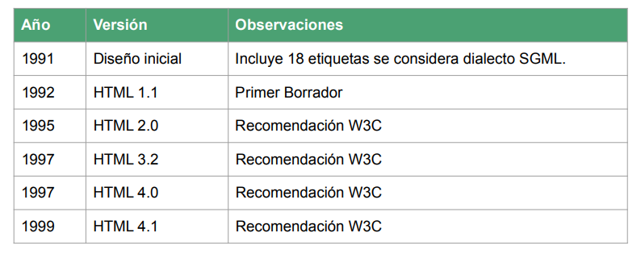
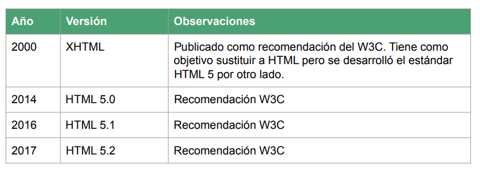
# XHTML diferencias, ventajas y desventajas con respecto a HTML
### Diferencias con html
* Sintaxis XML

* Documentos bien formados

* Mayúsculas y minúsculas

* Atributo xmlns

* Compatibilidad con navegadores

* Procesamiento del documento

* Uso de elementos vacíos
### Ventajas con html
* Sintaxis más Estricta

* Consistencia en el Cierre de Etiquetas

* Mejor Compatibilidad con Herramientas XML

* Interoperabilidad con XML

* Mejora en la Calidad del Código

* Mayor Legibilidad y Mantenibilidad
### Desventajas con html
* Menos Tolerante a Errores

* Curva de Aprendizaje Mayor

* Compatibilidad con Navegadores Antiguos

* Más Verboso

* Menos Adopción Generalizada

* Requiere un Mime Type Específico
## HTML 
* Estructura de un documento HTML: Podemos Observar lo siguiente
  * Doctype para validar el documento.
  * Cabecera
  * Cuerpo
  * Etiquetas tanto de apertura como de cierre

  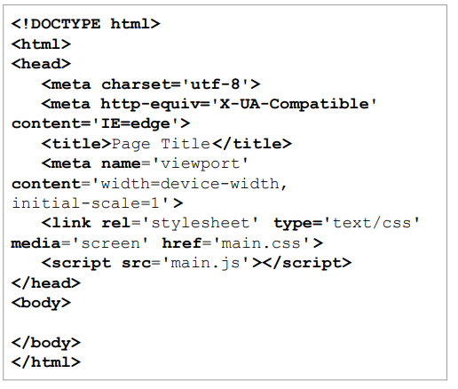
  
  * Como podemos ver en HTML comienza siempre por la etiqueta html.
  * Esta etiqueta será la raíz del documento; permite tener una serie de atributos comunes a todas las etiquetas HTML.

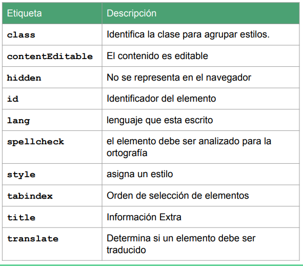

  * Entidades: En HTML se pueden utilizar entidades al igual que XML para representar caracteres especiales (o las vocales con tilde).

  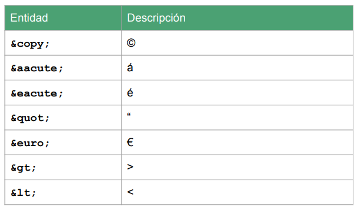

  Comentarios
  * Al igual que en XML, se pueden utilizar comentarios.

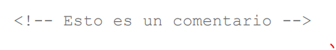

* Cabecera HTML:La cabecera del documento HTML permite establecer información del propio
documento como metadatos o scripts o estilos del mismo.
La cabecera HTML comienza por <head> y termina por </head>. Incluye los
siguientes elementos:
  * Title: Indica el título de la página

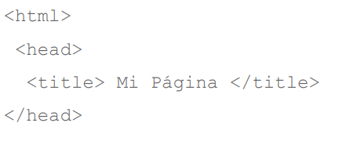

  * Meta: Indica los metadatos del documento.

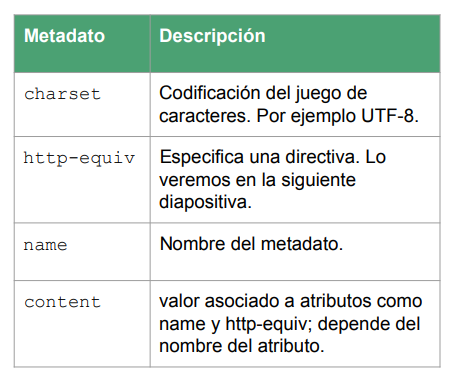

  * Style: Indica el estilo a utilizar.

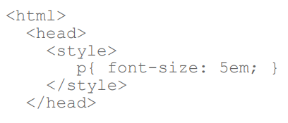

  * Link: Enlaza con otro documento (estilos).

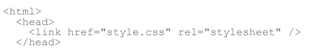

  * Script: Añade un Script basado en JavaScript u otros lenguajes de Script.

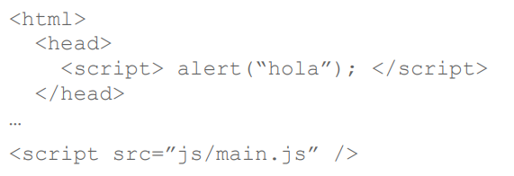

# Cuerpo HTML
Uno de los elementos principales de HTML es el cuerpo o body; es donde se
mostrarán todos los datos que serán representados al usuario.
Dentro del cuerpo de HTML podemos encontrar dos tipos de etiquetas o elementos:

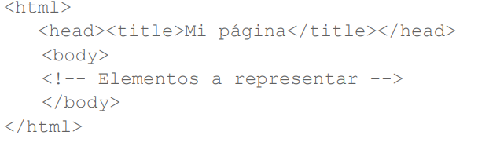

## Elementos de Bloque
   * Elementos de Bloque: Ocupan todo el espacio de su elemento padre (contenedor) y salvo excepciones permiten contener otros elementos.
     * Header: La etiqueta header, indica la cabecera de la web; normalmente almacena el encabezado de una web o sección; suele ser común añadir un logo y título (encabezado) de la web.

     * Nav: La etiqueta nav etiqueta está concebida para albergar enlaces de navegación; estos enlaces pueden ser internos o externos. Suele encontrarse después de la etiqueta header. Normalmente se incluye una lista para dichos enlaces
     * Main: La etiqueta main delimita el espacio del contenido principal; dentro puede haber distintas secciones y artículos. Es importante que haya una única etiqueta main para delimitar este espacio, y que esté bien estructurada, con distintas secciones. Dentro de esta etiqueta podemos encontrar las etiquetas section y article.
     * Aside: La etiqueta aside, permite definir un contenido auxiliar dentro del contenido principal de tal forma que sea un contenido fijo que muestre o un menú o información de interés general de la página.
     * Section: La etiqueta section, delimita las distintas secciones de una página; sobre todo se utiliza para separar y dar significado semántico a la web
     * Article: La etiqueta article, almacena información como una unidad independiente; como puede ser un artículo de una noticia o un comentario. No tiene una representación como tal pero sí es importante semánticamente.
     * Footer: La etiqueta footer delimita el pie de una página; normalmente delimita enlaces generales de la página o información sobre la misma, como puede ser contacto o dirección de correo.
     * Div:La etiqueta div, permite almacenar un contenedor de tal forma que podamos almacenar conjunto de contenedores con contenido de forma personalizada
## Elementos de Línea
   * Elementos de línea: Ocupan sólo el espacio que ocupa su contenido; contienen datos u otros elementos de línea.
     * Las listas, son elementos que permiten mostrar información de forma estructurada normalmente para diferenciar diferentes elementos o características. En HTML, podemos diferenciar 3 tipos:
       * Desordenadas: Las listas desordenadas (Elemento ul) permiten mostrar información de forma estructurada mostrando las llamadas viñetas Aunque se puede cambiar el formato de estas utilizando CSS.
       * Ordenadas: Una lista ordenada (ol), si tiene una numeración para cada elemento. Esta numeración puede cambiarse utilizando los siguientes atributos:
           * start: indica el inicio de la lista.
           * reversed: indica si es ascendente (valor false por defecto) o descendente (valor true).
           * type: Indica el tipo de lista:
             * a: Letras Minúsculas.
             * A: Letras Mayúsculas.
             * i: Números Romanos en Minúsculas.
             * I: Número Romanos en Mayúsculas.
             * 1: Para Números.
       * De Definición: Las listas de definición (dl) permiten mostrar diferentes definiciones de términos a partir de claves y su correspondiente valor. Se componen de los siguientes elementos:
           * dt: Término de la definición; en una lista puede haber varios términos para una definición.
           * dd: Definición; indica la definición de los diferentes términos.
## Elementos Multimedia para HTML5

  * Audio: El elemento audio, permite insertar un componente de sonido que esta soportado por la mayoría de navegadores; tiene los siguientes atributos:
      * src: URI del recurso; adicionalmente, se puede añadir un elemento source.
      * preload: indica cómo se realizará la precarga; los valores son none (no se precarga), metadata (se precargan los metadatos) y auto (a criterio del navegador).
      * autoplay: reproducción automática.
      * loop: reproducción en bucle.
      * muted: silencia el componente.
      * controls: proporciona una interfaz para el elemento.
  * Video: De forma análoga, el elemento video, incrusta un elemento visual para reproducir un vídeo. Tiene los siguientes elementos:
      * src: URI del recurso (también puede utilizarse source).
      * poster: URI de la imagen a mostrar mientras se carga.
      * playsinline: indica el vídeo dentro de su área de reproducción no a pantalla completa.
      * width y height: indican ancho y alto para la reproducción.

 * Track: El elemento track, puede utilizarse junto a los elementos audio o video;permite añadir información a dicho elemento, como pueden ser subtitulos. Tiene los siguientes atributos:
     * default: elemento track a utilizar por defecto.
     * kind: tipo de pista. subtitles (subtítulos), captions (transcripciones), descriptions (descripciones), chapters (capítulos) y metadata (metadatos no visibles).
     * label: título que describe la pista.
     * src: URI del elemento
     * srclang: idioma del elemento.
 * img: Elemento img es el que representa una imagen en HTML; normalmente a partir de un elemento externo representado por el atributo src. Permite muchos formatos de imagen como puede ser jpg,png,svg,etc… Tiene los siguientes atributos:
     * alt: texto con información alternativa; este texto es importante para la accesibilidad.
     * src: URI del recurso de imagen.
     * srcset y sizes: permite asignar diferentes recursos para que el navegador cargue la versión más adecuada.
     *  usemap: referencia un mapa definido por el elemento map.
     *  ismap: Indica que la imagen es parte de un mapa del lado del servidor.
     *  width y height: ancho y alto de la imagen.
     *  decoding: indica cómo se decodificar la imagen; tiene los valores async(asíncrono),sync(síncrono) y auto (el navegador decide).
     * loading: indica como cargará la imagen; tiene los valores eager (inmediatamente) o lazy (carga a posteriori)

 * map: El elemento map, permite realizar imágenes interactivas; de tal forma que podemos definir áreas de una imágen con enlaces o elementos los que ir. Normalmente son referenciados por parte de una imagen; y contienen una serie de elementos area.

 * svg: Normalmente, se trabajan con imágenes de mapa de bits (matrices de pixeles); pero estas tienen un inconveniente y es que se pueden deformar si se escalan. Por eso, se pueden trabajar con imágenes vectoriales. El elemento svg, permite trabajar con este tipo de imágenes a partir de primitivas expresadas en xml.

 * canvas: El elemento canvas, proporciona un lienzo sobre el que mostrar gráficos; normalmente utilizando lenguajes de script como JavaScript. Tiene los siguientes atributos:
     * width: ancho del elemento.
     * height: alto del elemento.
 * embed: El elemento embed, representa un contenido incrustado por un plugin o elemento externo; dependiendo del elemento o contenido será más o menos soportado por el navegador.
 * iframe: Un iframe, es un contenido de navegación anidado. Es decir, es un documento HTML externo incrustado. Tiene los siguientes atributos:
     * src: URI del recurso.
     * srcdoc: contiene el código HTML a mostrar en el elemento iframe (aunque puede estar dentro de la etiqueta).
     * sandbox: Permite proporcionar restricciones al documento incrustado en el elemento iframe.
     * allow: directivas referentes a permisos.
     * allowfullscreen: si existe permite establecer el tamaño a pantalla completa
     * width y height: alto y ancho en píxeles.
     * loading: puede tomar lazy o eager que se carga se haga visible.
 * El elemento iframe, es muy utilizado por ejemplo para incrustar vídeos ycontenido de webs como youtube u otras páginas.
 * object: El elemento object permite incrustar un elemento externo que puede ser una imagen u cualquier otro contenido relacionado. Puede tener los siguientes atributos:
     * data: contiene el recursos que se ha de mostrar.
     * type: tipo MIME.
     * name: nombre que puede ser utilizado para referenciar a este recurso.
     * usermap: referencia al atributo name de un elemento map.
     * form: referencia al atributo id de un formulario.
     * width y height: ancho y alto del elemento.

     # CSS
     ¿Que es el css?

Versiones 
CSS es mantenido por la W3C al igual que HTML y XML. Comenzó en 1996 y hoy
en día es indispensable para cualquier página web. Ha habido varias versiones de
CSS

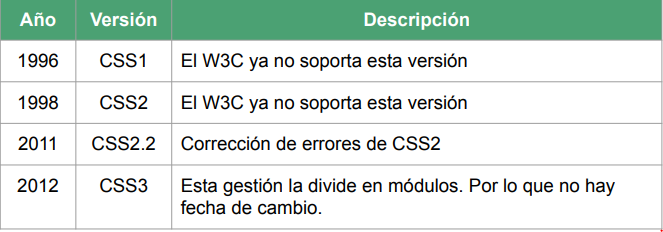

Como se agrega CSS a un documento HTML.
Se puede agregar de la siguiente forma: 
Como Documento externo usando una etiqueta link
link rel=”stylesheet” href=”estilos.css” 
Como elemento style dentro de la cabecera del documento
style
…
/style
Como elemento en línea usando el atributo style
p style=”color:white”>.../p

* **Selectores CSS** (incluyendo psecudoclases y pseudoelementos).
Como hemos comentado, un selector no es más que una regla para seleccionar
uno o varios elementos que modificarán sus reglas; podemos dividirlos en los
siguientes tipos:
   * Universal: selecciona todos los elementos; ejemplo: *
   * Tipo: Tipo de elemento: ejemplo: h1.
   * Clase: elementos de una determinada clase: .clase.
   * Identificador: elemento con un identificador en concreto; ejemplo: #elemento.
   * Atributo: elemento con un atributo en concreto; por ejemplo: input[type=”submit”].
   * Selectores
También podemos realizar combinaciones o agrupaciones:
   * Agrupación: aplicará las reglas a todos esos elementos o clases; ejemplo: h1,h2,h3.
   * Combinación: indica que sólo aplicará a la combinación de varios elementos; podemos clasificarlos en los siguientes casos:
     * Hermanos: Elemento hermano a otro; ejemplo: A~B.
     * Hijos: Elemento Hijo a otro; ejemplo: A>B.
     * Hermanos adyacentes: Elemento hermano a otro pero

 * **Pseudoclases:** Una pseudoclase es un modificador que se añade a un selector para que solo se aplique cuando dicho elemento pase a un estado específico; normalmente se establece con la siguiente sintaxis:

   * :active: cuando el elemento está activo.
   * :checked: cuando un checkbox está activo.
   * :disabled: cuando el elemento está deshabilitado.
   * :focus: Cuando el elemento tiene el foco.
   * :hover: Cuando el ratón pasa por encima.
   * :visited: Cuando el enlace apunta a una dirección ya visitada
anteriormente.

* **Pseudoelementos**
Un Pseudoelemento se añade a un selector para establecer el estilo de parte de
dicho elemento; por ejemplo la primera letra o palabra; Los pseudoelementos
pueden ser:
   * ::after: Permite añadir contenido después del elemento.
   * ::before: Permite añadir contenido antes del elemento.
   * ::first-letter: Primera letra del primer bloque de texto.
   * ::first-line: Primera línea del primer bloque de texto.
   * ::selection: Modificar el estilo cuando hay parte del contenido
seleccionado.
En CSS podemos encontrar los siguientes tipos de datos:
   *Entero: Números enteros positivos y negativos.
   * Número: número decimal.
   * Dimensión: un número con con una dimensión asociada; puede ser deg (grados), s(segundos) o px(píxeles).
   * Porcentaje: Indica un porcentaje o fracción se indica con el símbolo %.
   * Colores: indican un color que puede ser uno predeterminado (green, red, white…) valor RGB (rgba(22,33,11,20)), hexadecimal (#112233) o HSL (Hue Saturation Lightness) (hsl(0,100%,50%)).

Por otro lado, existen diferentes Unidades que pueden clasificarse en Absolutas o
relativas.
* **Unidades Absolutas:**
   * px: píxeles.
   * cm: centímetro.
   * mm: milímetro.
   * Q: Cuarto de milímetro.
   * in: Pulgada
   * pt: Puntos (1/72 in).
   * pc: Picas (1/16 in).
* **Unidades Relativas:**
   * em: Tamaño letra del padre.
   * ex: Altura de la fuente del elemento.
   * ch: Ancho del carácter.
   * rem: Tamaño de letra del elemento Raíz.
   * lh: Altura de la línea del elemento.
   * vw: 1% del ancho de ventana gráfica.
   * vh: 1% del alto de la ventana gráfica.
   * vmin: 1% de la dimensión más pequeña de la ventana gráfica.
   * vmax: 1% de la dimensión más grande de la ventana gráfica.
Propiedades CSS:

* **Modelo de cajas:** Es un módulo CSS que define cajas rectangulares, incluyendo sus rellenos y márgenes, que son generadas para los elementos y que se disponen de acuerdo al modelo de formato visual
Flex: Se mostrará como un bloque pero establece el modelo denominado flexbox;
estableciendo una dirección por la que fluye. Se utiliza la propiedad
flex-direction, para ver en qué dirección fluirá
Grid: Se mostrará como bloque pero establece una cuadrícula. Se utiliza la propiedad
grid-template-columns para establecer la cuadrícula y sus dimensiones.

* **Float:** Se puede establecer el comportamiento de dónde aparecerán los elementos y su
contenido con la propiedad float; tiene los siguientes valores:
   * left: empuja al elemento a la izquierda.
   * right: empuja al elemento a la derecha.
   * none: no empuja al elemento.
* **Position:** También es importante ver que la posición de un elemento pueda ser dependiendo
de su contenedor o por el mismo con la propiedad position; tiene los siguientes
valores:
   * static: valor por defecto; se posiciona siguiendo el flujo normal.
   * relative: Permite establecer su posición de forma relativa al anterior elemento.
   * absolute: Establece la posición absoluta con respecto al documento.
   * fixed: El elemento deja de seguir el flujo normal del documento.
   * Sticky: EL elemento se posiciona siguiendo el flujo normal y se pueden
establecer la posición límite con su contenedor.

* **Propiedades de texto:** Podemos establecer una serie de propiedades para dar formato al texto:
   * color: color del texto.
   * font-family: el tipo de letra; se establece como una lista con prioridad.
   * font-size: Tamaño del texto.
   * font-weight: Determina el grosor del trazo.
  * text-align: Determina la alineación del texto; tiene los valores: left, right, center y justify.
  * letter-spacing: espacio entre letras.
* **Propiedades de Listas:** Algunas de las propiedades que podemos establecer las listas son:
  * list-style-type: Indica el tipo de viñeta a utilizar; tiene los valores: disc, circle, square, decimal, lower-roman, upper-roman, lower-greek, lower-latin, lower-latin y none.
   * list-style-position: establece la posición de las viñetas; puede ser
inside u outside.
   * list-style-image: Establece una viñeta como una imagen pasando una URL.
* **Diseño adaptativo (Media Queries):** Hoy en día existen muchos dispositivos capaces de navegar por la web; desde ordenadores, tablets,
dispositivos móviles e incluso ya gafas de realidad aumentada.
Es por ello que se necesita adaptar el CSS para cada pantalla; por lo que se utilizan las llamadas media
queries; que permiten seleccionar una serie de reglas dependiendo del tamaño de la pantalla.

## 1. Sindicación de contenidos en la web.

La sindicación de contenidos en la web es un proceso mediante el cual se distribuye y comparte contenido digital de un sitio web a través de otros sitios web o plataformas en línea. Esto se logra mediante la utilización de formatos estándar de sindicación, como RSS (Really Simple Syndication) o Atom.

## 2. Sindicación de contenidos

La sindicación de contenidos es un proceso mediante el cual se comparten y distribuyen contenidos digitales, como artículos, noticias, blogs, podcasts, videos y otros tipos de información, a través de diferentes plataformas en línea. Este proceso se lleva a cabo utilizando formatos estándar de sindicación, como RSS (Really Simple Syndication), Atom o JSON Feed.

## 3. RSS (Sintaxis y ejemplo)

RSS (Really Simple Syndication) es un formato de sindicación web que se utiliza para distribuir y compartir contenido digital de manera estandarizada. Se utiliza principalmente en blogs, sitios de noticias y otros sitios web que publican contenido periódicamente.

Las fuentes RSS contienen resúmenes o extractos de las publicaciones de un sitio web, junto con metadatos como el título, la fecha de publicación y un enlace al contenido completo. Estas fuentes se actualizan automáticamente cada vez que se publica nuevo contenido en el sitio web original.

Vamos a comentar la sintaxis de RSS:
* El elemento raíz siempre será <rss> que tendrá el atributo version con el
valor 2.0.
* Este elemento tendrá un subelemento llamado <channel> por cada canal de
suscripción que tenga la web.

 
 
 
 

## 4. Atom (sintaxis y ejemplo)

Atom es otro formato de sindicación web, similar a RSS (Really Simple Syndication). Al igual que RSS, Atom es un estándar XML utilizado para compartir y distribuir contenido actualizado de manera regular, como blogs, noticias y otros tipos de contenido en línea.

Algunas de las diferencias entre Atom y RSS incluyen:

* Estructura más definida: Atom tiene una estructura más definida y formal que RSS, lo que lo hace más flexible y extensible para adaptarse a diferentes tipos de contenido y necesidades.
* Soporte para metadatos: Atom incluye un soporte más robusto para metadatos, lo que permite una descripción más detallada del contenido, como la autoría, las etiquetas y la información de derechos de autor.
* Mayor claridad en la especificación: Atom tiene una especificación más clara y bien definida en comparación con RSS, lo que facilita su implementación y desarrollo de herramientas relacionadas.
 
 
 
 
 

## 5. Herramientas de validación de canales de sindicación

Podemos utilizar validadores para ver que realmente nuestro canal de sindicación
funciona correctamente:

 (https://validator.w3.org/feed/#validate_by_input)
 
## 6. Añadir canales de sindicación a una web.

Los ficheros RSS o Atom, pueden ser añadidos a una web HTML, usando un enlace
<a> como si de un fichero se tratara.
Sin embargo, existe una forma mejor que sobre todo da contenido semántico; y es
utilizar la etiqueta <link> en la cabecera <head>.

 
 

## 7. Agregadores de canales

Podemos encontrar muchas aplicaciones que son capaces de leer este tipo de
formato; pudiendo ser tanto locales; como en línea. Esta aplicaciones se llaman
agregadores de contenido:

* Agregadores de contenido locales: NewsFox, RSSOwl.
* Agregadores de contenido en línea: Feedly, The Old Reader.
* Agregadores de contenido como extensión; estos se añaden como extensiones o plugins al navegador.

## 8. Canales de sindicación

Los canales de sindicación, también conocidos como "feeds" o "flujos", son recursos web que proporcionan actualizaciones periódicas sobre contenido específico, como noticias, blogs, podcasts o vídeos. Estos canales se basan en estándares de sindicación web como RSS (Really Simple Syndication) o Atom.

