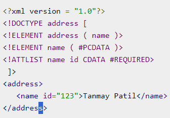

# Cuaderno Lenguaje de marcas

## Tabla de contenidos

## Enlaces de interes
* https://www.w3.org/

## Actividad Cuaderno UD1
### Añadir los siguientes apartados:
#### Que es un lenguaje de marcas
Es un modo de codificar un documento junto con el texto que permite incorporar etiquetas con informacion adicional del texto
#### Evolucion de los Lenguajes de marcas:
* GML Es un sublenguaje de XML que se utiliza para el modelaje, transporte y almacenamiento de informacion geografica, basicamente es un archivo que contiene inforamcion acerca de las coordenadas de una parcela o edificacion. Fue creado por charles Goldfarb, Edwad Mosher y Raymon lorie entre 1969 y 1970

* SGML Es un estandar para definir lenguajes de marcado generalizados para documentos, fue diseñador en la decada de 1980 por la ISO y se convirtio en el estandar internacional para la creacion de documentos electronicos complejos

#### Características de los lenguajes de marcas

Las principales caracteriticas del leguaje de marcas son los siguientes:

**Independecia** (Su uso no depende de ninguna plataforma hardware ni software concreto)

**Almacenados en texto plano** (El documento solo esta compuesto por caracteres texto)

**Flexibilidad** (Deben ser flexibles para utilizarlos en diferentes contextos)

**Compactibilidad** (Las marcas y el contenido estan dentro del mismo documento) 

**Facilidad de procesamiento** (El formato debe tener un diseño sencillo para que el procesamiento automatico sea facil).

#### Características y ejemplos de los siguientes lenguajes de marcas
* XML

**Extensible:** Define nueva etiquetas

**Estructurado:*** Se puede modelar datos a cualquier nivel de complejidad

**Validable:** Cada documento se puede validad frente a una DTD
Independiente de medio: Puede publicarse en multiples formatos

**Independiente de fabricante:** XML es una herramienta facil de aprender y usar

* HTML

**Es facil de usar y aprender**

**Se utiliza para crear paginas**

**Permite describir hipertextos**

**permite archivos pequeños**

**Tiene etiquetas limitadas**

**Lenguaje estatico**

**Tiene un despliegue rapido**

**Es multiplataforma, basicamente se accede de cualquier lado**

* JSON

**Es un lenguaje modelador de datos**

**Consistes en pares claves-valor**

**Formato flexible, ligero y facilmente transferible a traves de las redes**

* YAML

**Utiliza la tabulacion para indicar su estructura**

**Lo elementos que forman una secuencia utilizan un guion medio**

**Los contenidos en YAML se describen utilizando el conjunto de caracteres imprimibles de Unicode, bien en UTF-8 o UTF-16**

**Los comentarios vienen encabezados por la almohadilla**
** **

#### XML: definicion y caracteristicas del metalenguaje
XML es un metalenguaje que te va a permitir mediante varias etiquetas crear nuevos lenguajes de marcas o dialectos debido a unas reglas que define, esta mantenido por la W3C y proviene del estandar SGML
* Prologo: Es un documento XML opcional que tiene informacion relativa al propiodocumento, contiene los siguientes elementos

 **Version** Es la version de xml

 **Encoding** Indica en que esta codificado el documento

 **standalone** Indica la existencia de un esquema XML

 

* Contenido: Es todo lo que se encuentra entre las etiquetas de apertura y cierre

* Atributos: Es una opcion del xml que te aporta informacion extra sobre el elemento que contiene

* Ejemplos en XML

Aqui tenemos un ejemplo que habla sobre pajaros, y se centra en las especies,nombres y en la region que viven los buhos

## Documentos XML, estructura:
La **Declaracion o prologo** es un elemento opcional que esta a principio del documento, puede contener los siguientes atributos

Aqui en el siguiente ejemplo podemos ver un prologo con sus atributos

Los **elementos** son contenedores que almacenan texto, atributos, elementos
atributos, objetos de soporte

Aqui se puede ver un ejemplo para quede mas claro 

Los **atributos** son informacion adicional dentro de un elemento que tiene que tener un valor entre comillas, siempre debe aparecer en la etiqueta de apertura, pueden ser opcionales y pueden comenzar con un guion bajo o caracter

Un **comentario** añade informacion extra sin que tenga que ser procesada, suele utilizarse para ayudar y guiar al usuario

Aqui se ve un ejemplo de comentario

Los **Espacios de Nombres** es un identificador que nos sirve para resolver ambiguedades que pueden surgir conado hay dos o mas elementos iguales

Aqui se puede observar un ejemplo en un xml

Entidades permite incluir informacion predefinida en un documento, existen 5 entidades generales

Estas son las 5 entidades que existen

CDATA son conjuntos de caracteres que no debe ser tratado por el analizador que si formara parte de la informacion a diferencia del comentario 

Aqui tenemos un ejemplo del CDATA

## Validación de documentos:
es la comprobación de que un documento en lenguaje XML está bien formado y se ajusta a una estructura definida
### DTD:
Es una serie de reglas que van a permitir validar que la estructura de un documento es valida, puede ser interno (forma parte del documento)

Las **Entidades** sirven para establecer un valor en el dtd, existen entidades **internas** definidas en el propio dtd y entidades **externas** definidas fuera del dtd

**Anotaciones** nos permite identificar el formato de entidades que no son xml y que no se van a procesar, pueden ser publicas o prividas

**Elementos** sirve para definir una estructura de uno o varios elmentos que contiene el documento, podemos definir una cardinalidad a cada elemento 

**Atributos** en dtd sirve para dar mas informacion sobre el elemento

Aqui tenemos un ejemplo de un atributo en dtd

### XMLSchema
Definición Es un lenguaje de esquema utilizado para describir la estructura y las restricciones de los contenidos de los documentos XML

La Estructura Básica es la siguiente:
* Elementos
* restricciones
* subElemntos
* Atributos
* Comentarios

Los **elementos** se pueden clasificar en:
 * **Locales:** Hijos de los elementos que no son el elemento raíz y  sólo se usan una vez.
 * **Globales:** Hijos del elemento raíz y pueden ser reutilizados.

**Elementos Simples** Guarda un texto, numero, fecha,etc.. se debe establecer el atributo type o utiizar una restriccion

**Elementos Complejos** Guara dentro elementos hijos y se pueden establecer restricciones a las relaciones

**Subelementos** son los establecen una relacion de lso elementos contenidos respecto al padre, son los siguientes

  * xs:sequence: Indica una secencia de elementos obligatorios contenidos con respecto al padre

  * xs:choice: señala una secuencia de elementos alternativos

  * xs:all: inidica una secuencia de elemntos opcionales 

**Atributos** se pueden guardar tanto en elementos simples y complejos, aqui a continuacion los valores que se pueden poner:
* name: nombre del atributo
* type: tupo de datos
* use: Indica su obligatoriedad, hay los siguientes
  * required: Es obligatorio
  * optional: Es opcional
  *  prohibited: Esta prohibido usarlo

**Restricciones** sirve para establecer unas prohibiciones dentro del documento

**Tipos de Datos** ahora acontinucacion se vera una captura con algunos de los tipos de datos que puedes introducir en xmlschema

Comentarios en XMLSChema se establecen comentarios para ayudar a su comprension

Aqui se ve como se introduce el comentario

# Sistemas de gestión de información:
Un **Sistema de gestión de Información**, son programas informáticos, diseñados para dar soporte a cualquier de los procesos que se realizan en una empresa. Todos los sistemas de gestión de información pueden ejecutarse tanto en máquinas locales, como en otras pertenecientes a terceras empresas mediante la computación en la nube.
* Características 
   * Búsqueda y seguimiento de la redundancia de los datos
   * Consistencia en la información almacenada
   * Integridad de la información asegurada
   * Seguridad de la base de datos

* Tipos: Podemos encontrar tres tipos de sistemas de gestion de la informacion
  * **ERP**(Sistema de planificación de recursos empresariales o Enterprise Resource Planning):  Es un sistema informático que integra los múltiples procesos específicos que hay en una empresa. Un ERP, puede considerarse un producto software que cubren una necesidad pero sin estar dirigido a una empresa en concreto que ,normalmente, puede ser personalizado

  * **CRM** (Customer RelationShip Management): Es un tipo de Sistema de Gestión de información específico para atender todo lo relacionado con los clientes y la relación con la propia empresa. Es una herramienta fundamental en la gestión del activo más importante para cualquier empresa

  * **BI** (Bussines itelligence): Son una serie de tecnologias que tienen un objetivo en común que es ayudar en el proceso de dirección de una empresa
# ERP
* **Características**
  * Funcional
  * Modular
  * Centralizado
  * Robusto
  * Seguro
  * Mantenible
  * Adaptable

* **Beneficios**
  * Optimiza los procesos de gestión
  * Mejora la productividad
  * Simplificación de las tecnologías de la información de la compañia
  * Mejora en los procesos de decisión como consecuencia de la centralización de la información y del acceso a los datos en tiempo real.
  * Reduce los costes de gestión de la información.
  * Facilitan la escalabilidad del sistema.
  * Permiten incrementar la seguridad de la información

* **Ejemplo ERP Más conocidos**
  * SAP
  * NetSuite / ERP Cloud (Oracle). --> -->
  * SAGE
  * Microsoft Dynamics 365 (Microsoft).
  * IFS
  * ERPNext (libre)
  * Odoo (Libre)
  * Apache OfBiz (libre)
  * WebERP (Libre)
# CRM
* **Características**
  * Gestión de contactos
  * Clasificación de los clientes
  * Unificación de canales
  * Automatización y seguimiento de flujos de trabajo
  * Gestión de redes sociales
* **Beneficios**
  * Facilitan la toma de decisiones
  * Incrementan las oportunidades de venta
  * Ayudan en el proceso de mejora continua

* **Ejemplos CRM Más conocidos**
  * Salesforce
  * Microsoft Dynamics 365 CRM (Microsoft)
  * Zoho CRM
  * SAP Customer Experience
  * Oracle Customer Experience
# BI
## Definición y componentes
* Se compone de los siguientes sistemas que ayudan a este proceso
  * **ETL** (Extract, Transform and load): Es el proceso por el cual se obtiene información de las operaciones diarias realizadas por la empresa, se procesan y se guardan en un almacén de datos
  * **Data WareHouse** (almacén de datos): es el conjunto de datos de una compañía que permiten una correcta toma de decisiones. Este conjunto de datos, puede almacenar no solo los datos en bruto, sino también los procesados por un ETL
  * **OLAP** (Online Analytical Processing o procesamiento analítico en línea): Nos facilita el acceso a los datos almacenados en el Data Warehouse para alimentar el proceso de minado de datos (Data Mining)
  * **Data Mining** (Minado de datos); es un proceso que consiste en buscar patrones repetitivos en grandes volúmenes de datos; normalmente obtenidos desde los almacenes de datos (data warehouse)
  * **DashBoard** (Cuadro de mandos): Es un proceso o normalmente una aplicación que permite de forma visual, ver datos en conjunto de forma general, para poder ver de un vistazo los datos requeridos e incluso hacer algunas acciones

  HTML y su evolución
XHTML diferencias, ventajas y desventajas con respecto a HTML
Estructura de un documento HTML
Cabecera HTML
Title
Meta
Style
Link
Script
Cuerpo HTML
Elementos de Bloque
Definir los diferentes elementos de bloque existentes.
Elementos de Línea
Definir los diferentes elementos de línea existentes.
Listas, tablas y Formularios
Elementos Multimedia para HTML5
Herramientas de edición y desarrollo web.